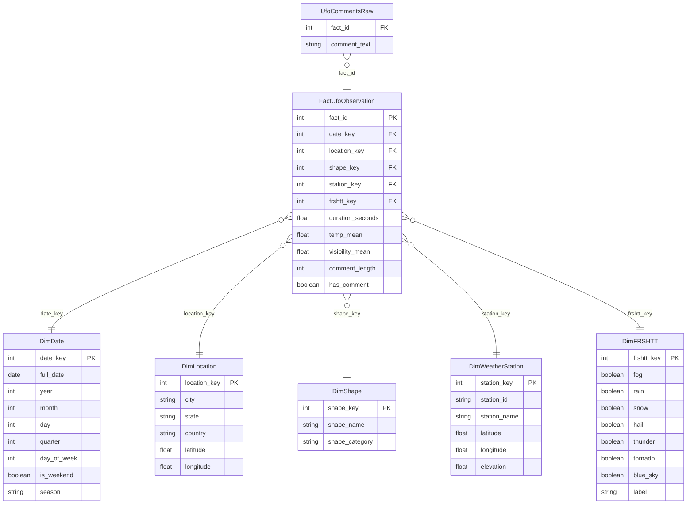

# UFO Sightings & Weather Correlation – Data Engineering Project (INSA Lyon)


This project is part of the **Data Engineering** course at **INSA Lyon**, supervised by  
Prof. Riccardo Tommasini.  
Course link: https://www.riccardotommasini.com/courses/dataeng-insa-ot/

The repository implements a complete, production-style data engineering architecture based on:

- **Apache Airflow** for pipeline orchestration  
- **PostgreSQL** for persistent storage  
- **PgAdmin** for database administration  
- **Streamlit** for data visualization  
- **Redis** as Airflow's Celery broker  
- **Docker Compose** for containerization  
- **Makefile** for development automation  

The project builds a fully operational pipeline that ingests two heterogeneous datasets (UFO sightings + NOAA weather), cleans and enriches them, and loads them into an analytical data warehouse following a **star schema**.

---

# 1. Project Overview

This project explores potential correlations between **UFO sightings** reported to NUFORC and **meteorological conditions** collected by NOAA weather stations.

It implements a full data pipeline:

1. **Ingestion** of raw datasets in the landing zone  
2. **Staging**: cleaning, transformation, geospatial enrichment  
3. **Curated zone**: building a star-schema data warehouse in PostgreSQL  
4. **Visualization & Analytics** through SQL queries and Streamlit  

The final dataset enables answering questions such as:

- Are UFO sightings more common during specific weather conditions (fog, rain, thunderstorms, clear sky)?  
- Are sighting durations influenced by visibility or temperature?  
- Do some regions or periods exhibit distinctive UFO activity once weather is accounted for?

---

# 2. Data Sources

## 2.1 NUFORC UFO Sightings  
Kaggle: https://www.kaggle.com/datasets/NUFORC/ufo-sightings  

Dataset containing UFO reports with:
- `datetime`
- city, state, country
- latitude, longitude
- object shape
- duration in seconds
- description text

## 2.2 NOAA GSOD (Global Surface Summary of the Day)  
Kaggle: https://www.kaggle.com/datasets/noaa/gsod  

Dataset with one row per **station × day**, including:
- temperature (mean, min, max)
- wind speed, wind gust
- visibility
- precipitation, snow depth
- `FRSHTT` (Fog, Rain, Snow, Hail, Thunder, Tornado)
- station metadata (ID, name, coordinates, elevation)

## Why these sources?
- Structurally different (event log vs. sensor time-series)
- Different granularity (episodic vs. daily)
- Different acquisition methods (human reports vs. automated weather sensors)
- Perfectly complementary for spatio-temporal enrichment

---

# 3. Analytical Questions

1. **Frequency & Weather**  
   Are UFO sightings more frequent under certain weather conditions?

2. **Duration & Meteorology**  
   Does visibility or temperature influence sighting duration?

3. **Spatio-Temporal Patterns**  
   Are there regions or seasons where sightings are more common when accounting for weather?

---

# 4. Architecture

A complete DE architecture is implemented using Docker Compose:

```
          ┌──────────────┐
          │  Streamlit   │  ← Data visualization
          └──────┬───────┘
                 │
                 ▼
    ┌─────────────────────┐
    │   Apache Airflow    │  ← Pipeline orchestration
    │ (Scheduler, Worker) │
    └────────┬────────────┘
             │
             ▼
    ┌─────────────────────┐
    │    PostgreSQL DB    │  ← Curated data warehouse
    └────────┬────────────┘
             │
             ▼
    ┌─────────────────────┐
    │       Redis         │  ← Celery broker for Airflow
    └─────────────────────┘
```


## Services and Ports

| Service        | Port   | Description                         |
| -------------- | ------ | ----------------------------------- |
| Airflow UI     | 8080   | DAG management and monitoring       |
| PgAdmin        | 5050   | PostgreSQL administration UI        |
| Streamlit      | 8501   | Data exploration & visualizations   |
| PostgreSQL     | 5432   | Analytical database                 |
| Redis          | 6379   | Celery message broker               |

All services are fully containerized and managed through `docker-compose`.

---

# 5. Data Pipeline Architecture

The pipeline implements the classic **Landing → Staging → Curated** architecture.

## 5.1 Landing Zone
- Stores raw UFO and GSOD datasets exactly as downloaded.
- No transformation involved.

## 5.2 Staging Zone
Cleaning and enrichment:

### UFO staging:
- Parse `datetime`, extract date
- Convert duration to numeric
- Normalize location fields
- Compute comment statistics
- Remove invalid or incomplete rows

### Weather staging:
- Parse date
- Clean sentinel values (9999.9, 99.99, etc.)
- Decode `FRSHTT` into six boolean columns

### Enrichment:
- Assign each UFO sighting to its **nearest active NOAA station** using Haversine distance
- Attach:
  - temperature
  - visibility
  - selected weather metrics
- Build staging tables for all future dimensions

The staging zone is persistent.

## 5.3 Curated Zone (Data Warehouse)
Implements a star schema:

### Fact table:
`FactUfoObservation`

### Dimensions:
`DimDate`, `DimLocation`, `DimShape`, `DimWeatherStation`, `DimFRSHTT`, plus a text table `UfoCommentsRaw`.

SQL views are created for analysis (counts, trends, weather relationships).

---

# 6. Star Schema

## 6.1 Fact Table: `FactUfoObservation`

| Column | Description |
|--------|-------------|
| fact_id | Primary key |
| date_key | FK to DimDate |
| location_key | FK to DimLocation |
| shape_key | FK to DimShape |
| station_key | FK to DimWeatherStation |
| frshtt_key | FK to DimFRSHTT |
| duration_seconds | Numeric measure |
| temp_mean | Weather measure |
| visibility_mean | Weather measure |
| comment_length | Derived measure |
| has_comment | Boolean |

## 6.2 Dimensions

#### `DimDate`
Contains year, month, day, weekday, season, etc.

#### `DimLocation`
Sighting location:
- city, state, country, latitude, longitude

#### `DimShape`
Object shapes:
- shape name
- optional shape category

#### `DimWeatherStation`
NOAA station metadata:
- station_id, name, latitude, longitude, elevation

#### `DimFRSHTT`
Encodes combinations of weather phenomena from the FRSHTT bitmask:
- fog, rain, snow, hail, thunder, tornado
- label
- blue_sky (true if all flags = 0)

## 6.3 Text Table (Not in star schema)
`UfoCommentsRaw`
- `fact_id`
- `comment_text` (raw NUFORC text)

Used for potential future NLP

---

# 7. ERD (Mermaid)



---

# 8. Environment Setup

## Clone the repository

```bash
git clone <repo-url>
cd atay
```

## Configure environment variables

Copy the template file:

```bash
cp docker/config/.env.example docker/config/.env
```

Adjust values if needed (ports, database passwords, etc.).

---

# 9. Running the Project (Makefile)

### Initialize Airflow (first time only)

```
make init-airflow
```

### Start all services

```
make run-airflow
```

Services will be available at:

* Airflow: [http://localhost:8080](http://localhost:8080)
* Streamlit: [http://localhost:8501](http://localhost:8501)
* PgAdmin: [http://localhost:5050](http://localhost:5050)

### Stop containers

```
make stop
```

### Stop and remove volumes

```
make stop-with-volumes
```

### Clean staging & curated data

```
make clean
```

### Run a local ETL script

```
make run-etl
```

### Launch Streamlit only

```
make run-app
```

### Check container status

```
make check-airflow
```

---

# 10. Technical Details

* **Airflow**: 3.1.0
* **Python**: 3.13
* **Docker Compose**: orchestrates Airflow, Postgres, Redis, PgAdmin, Streamlit
* **Data directories**:

  * `data/raw` – landing zone
  * `data/staging` – staging zone
  * `data/curated` – star schema tables
* **Airflow logs** stored under `logs/`.

---

# 11. Best Practices

* Use `make stop-with-volumes` for a full Airflow reset.
* DAGs are located in `src/dags/`. Any new DAG requires restarting Airflow.
* Use staging tables for data quality checks before loading curated data.
* Keep raw data immutable in `data/raw/`.

---

# Authors

* **Nihal**
* **Zineb**
* **Junior**
