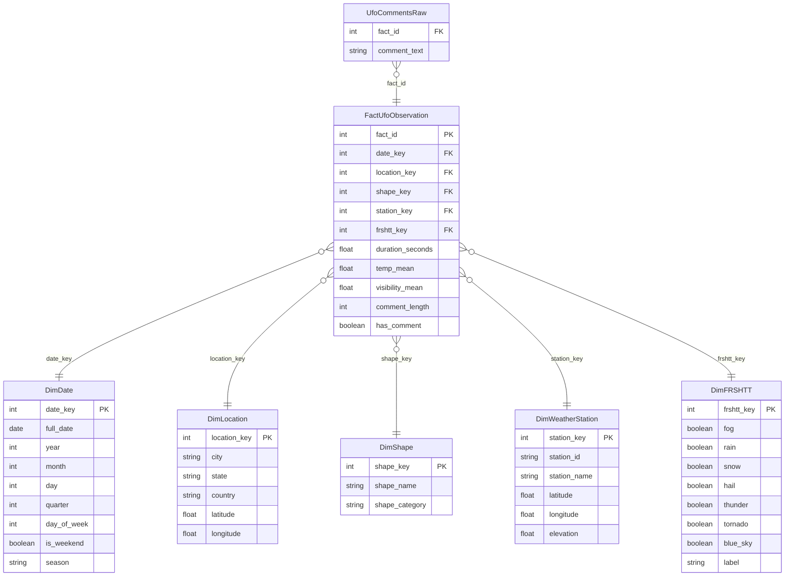

# UFO Sightings & Weather Correlation – Data Engineering Project (INSA Lyon)


This project is part of the **Data Engineering** course at **INSA Lyon**, supervised by  
Prof. Riccardo Tommasini.  
Course link: https://www.riccardotommasini.com/courses/dataeng-insa-ot/

The repository implements a complete, production-style data engineering architecture based on:

- **Apache Airflow** for pipeline orchestration  
- **PostgreSQL** for persistent storage  
- **PgAdmin** for database administration  
- **FastAPI** backend API for data access  
- **React + TypeScript** frontend for data visualization  
- **Streamlit** alternative Python dashboard for data analysis  
- **Redis** as Airflow's Celery broker  
- **MongoDB** available for document storage (optional)  
- **Docker Compose** for containerization  
- **Makefile** for development automation  

The project builds a fully operational pipeline that ingests two heterogeneous datasets (UFO sightings + NOAA weather), cleans and enriches them, and loads them into an analytical data warehouse following a **star schema**.

---

# 1. Project Overview

This project explores potential correlations between **UFO sightings** reported to NUFORC and **meteorological conditions** collected by NOAA weather stations.

It implements a full data pipeline:

1. **Ingestion** of raw datasets in the landing zone  
2. **Staging**: cleaning, transformation, geospatial enrichment  
3. **Curated zone**: building a star-schema data warehouse in PostgreSQL  
4. **Visualization & Analytics** through React frontend and FastAPI backend  

The final dataset enables answering questions such as:

- Are UFO sightings more common during specific weather conditions (fog, rain, thunderstorms, clear sky)?  
- Are sighting durations influenced by visibility or temperature?  
- Do some regions or periods exhibit distinctive UFO activity once weather is accounted for?

---

# 2. Data Sources

## 2.1 NUFORC UFO Sightings  
Kaggle: https://www.kaggle.com/datasets/NUFORC/ufo-sightings  

Dataset containing UFO reports with:
- `datetime`
- city, state, country
- latitude, longitude
- object shape
- duration in seconds
- description text

## 2.2 NOAA GSOD (Global Surface Summary of the Day)  
NOOA: https://www.ncei.noaa.gov/data/global-summary-of-the-day/archive 

Dataset with one row per **station × day**, including:
- temperature (mean, min, max)
- wind speed, wind gust
- visibility
- precipitation, snow depth
- `FRSHTT` (Fog, Rain, Snow, Hail, Thunder, Tornado)
- station metadata (ID, name, coordinates, elevation)

## Why these sources?
- Structurally different (event log vs. sensor time-series)
- Different granularity (episodic vs. daily)
- Different acquisition methods (human reports vs. automated weather sensors)
- Perfectly complementary for spatio-temporal enrichment

---

# 3. Analytical Questions

1. **Frequency & Weather**  
   Are UFO sightings more frequent under certain weather conditions?

2. **Duration & Meteorology**  
   Does visibility or temperature influence sighting duration?

3. **Spatio-Temporal Patterns**  
   Are there regions or seasons where sightings are more common when accounting for weather?

---

## Services and Ports

| Service        | Port   | Description                         |
| -------------- | ------ | ----------------------------------- |
| Frontend       | 3000   | React application (Vite)            |
| Streamlit      | 8501   | Streamlit dashboard (Python)        |
| Backend API    | 8000   | FastAPI with Swagger docs           |
| Airflow UI     | 8080   | DAG management and monitoring       |
| PgAdmin        | 5050   | PostgreSQL administration UI        |
| Mongo Express  | 8081   | MongoDB administration UI           |
| PostgreSQL     | 5432   | Analytical database                 |
| MongoDB        | 27017  | Document store (optional)           |
| Redis          | 6379   | Celery message broker               |

All services are fully containerized and managed through `docker-compose`.

---

# 4. Data Pipeline Architecture

The pipeline implements the classic **Landing → Staging → Curated** architecture.

## 4.1 Landing Zone
- Stores raw UFO and GSOD datasets exactly as downloaded.
- No transformation involved.

### Design Decision: MongoDB vs. File-based Landing

The architecture includes **MongoDB** as an optional document store for the landing zone. While the ingestion pipeline code to load raw data into MongoDB collections is fully implemented (see `etl/ingestion.py`), this feature has been **intentionally disabled** (commented out in `dag_ingestion.py`) for the following reasons:

1. **Data Volume**: The GSOD dataset spans multiple decades and contains **millions of records** (50+ million rows when merged). Loading this into MongoDB document-by-document is extremely time-consuming.
2. **Performance Trade-off**: For batch analytics pipelines, file-based storage (CSV/Parquet) offers better I/O performance than document retrieval from MongoDB.
3. **Resource Constraints**: In a development/demo environment, MongoDB insertion adds significant overhead without proportional benefits for our analytical use case.
4. **Pragmatic Choice**: The star-schema warehouse in PostgreSQL is the primary analytics target. MongoDB would only serve as an intermediate store, adding complexity without analytical value.

> **Note**: The MongoDB service remains available in `docker-compose.yml` and the insertion code is preserved for scenarios requiring document-based access or real-time ingestion patterns.

### Design Decision: Redis Caching (Not Implemented)

The architecture includes a **Redis** container, initially intended to serve as a **caching layer** between the FastAPI backend and the React frontend. The goal was to:

1. **Reduce database load**: Cache frequent queries (e.g., statistics, dimension lookups) to avoid redundant PostgreSQL hits.
2. **Improve response times**: Serve cached JSON responses in milliseconds instead of running SQL aggregations.
3. **Enable real-time features**: Support WebSocket subscriptions or live dashboard updates.

**Why it was not implemented**:
- **Time constraints**: Priority was given to completing the core ETL pipeline and star schema.
- **Current performance acceptable**: With ~87,000 records, PostgreSQL queries remain fast enough for the demo.
- **Future enhancement**: The Redis service is ready in `docker-compose.yml` and can be integrated using `redis-py` with FastAPI dependency injection.

> Redis currently serves only as **Airflow's Celery broker** for task distribution. The caching functionality remains a planned enhancement.

## 4.2 Staging Zone
Cleaning and enrichment:

### UFO staging:
- Parse `datetime`, extract date
- Convert duration to numeric
- Normalize location fields
- Compute comment statistics
- Remove invalid or incomplete rows

### Weather staging:
- Parse date
- Clean sentinel values (9999.9, 99.99, etc.)
- Decode `FRSHTT` into six boolean columns

### Enrichment:
- Assign each UFO sighting to its **nearest active NOAA station** using Haversine distance
- Attach:
  - temperature
  - visibility
  - selected weather metrics
- Build staging tables for all future dimensions

The staging zone is persistent.

## 4.3 Curated Zone (Data Warehouse)
Implements a star schema:

### Fact table:
`FactUfoObservation`

### Dimensions:
`DimDate`, `DimLocation`, `DimShape`, `DimWeatherStation`, `DimFRSHTT`, plus a text table `UfoCommentsRaw`.

SQL views are created for analysis (counts, trends, weather relationships).

---

# 5. Star Schema

## 5.1 Fact Table: `FactUfoObservation`

| Column | Description |
|--------|-------------|
| fact_id | Primary key |
| date_key | FK to DimDate |
| location_key | FK to DimLocation |
| shape_key | FK to DimShape |
| station_key | FK to DimWeatherStation |
| frshtt_key | FK to DimFRSHTT |
| duration_seconds | Numeric measure |
| temp_mean | Weather measure |
| visibility_mean | Weather measure |
| comment_length | Derived measure |
| has_comment | Boolean |

## 5.2 Dimensions

#### `DimDate`
Contains year, month, day, weekday, season, etc.

#### `DimLocation`
Sighting location:
- city, state, country, latitude, longitude

#### `DimShape`
Object shapes:
- shape name
- optional shape category

#### `DimWeatherStation`
NOAA station metadata:
- station_id, name, latitude, longitude, elevation

#### `DimFRSHTT`
Encodes combinations of weather phenomena from the FRSHTT bitmask:
- fog, rain, snow, hail, thunder, tornado
- label
- blue_sky (true if all flags = 0)

## 5.3 Text Table (Not in star schema)
`UfoCommentsRaw`
- `fact_id`
- `comment_text` (raw NUFORC text)

Used for potential future NLP

---

# 6. ERD (Mermaid)


```mermaid
erDiagram

    FactUfoObservation {
        int fact_id PK
        int date_key FK
        int location_key FK
        int shape_key FK
        int station_key FK
        int frshtt_key FK
        float duration_seconds
        float temp_mean
        float visibility_mean
        int comment_length
        boolean has_comment
    }

    DimDate {
        int date_key PK
        date full_date
        int year
        int month
        int day
        int quarter
        int day_of_week
        boolean is_weekend
        string season
    }

    DimLocation {
        int location_key PK
        string city
        string state
        string country
        float latitude
        float longitude
    }

    DimShape {
        int shape_key PK
        string shape_name
        string shape_category
    }

    DimWeatherStation {
        int station_key PK
        string station_id
        string station_name
        float latitude
        float longitude
        float elevation
    }

    DimFRSHTT {
        int frshtt_key PK
        boolean fog
        boolean rain
        boolean snow
        boolean hail
        boolean thunder
        boolean tornado
        boolean blue_sky
        string label
    }

    UfoCommentsRaw {
        int fact_id FK
        string comment_text
    }

    FactUfoObservation }o--|| DimDate : "date_key"
    FactUfoObservation }o--|| DimLocation : "location_key"
    FactUfoObservation }o--|| DimShape : "shape_key"
    FactUfoObservation }o--|| DimWeatherStation : "station_key"
    FactUfoObservation }o--|| DimFRSHTT : "frshtt_key"
    UfoCommentsRaw }o--|| FactUfoObservation : "fact_id"
```

---

# 7. Environment Setup

## Clone the repository

```bash
git clone <repo-url>
cd atay
```

## Configure environment variables

Copy the template file:

```bash
cp config/.env.example docker/.env
```

For Linux/WSL, set your user ID:

```bash
echo "AIRFLOW_UID=$(id -u)" >> docker/.env
```

Adjust values if needed (ports, database passwords, etc.).

---

# 8. Running the Project (Makefile)

### Initialize Airflow (first time only)

```
make init-airflow
```

### Start all services

```
make run-airflow
```

Services will be available at:

* Airflow: [http://localhost:8080](http://localhost:8080) (airflow/airflow)
* Frontend (React): [http://localhost:3000](http://localhost:3000)
* Frontend (Streamlit): [http://localhost:8501](http://localhost:8501)
* Backend API: [http://localhost:8000/docs](http://localhost:8000/docs)
* PgAdmin: [http://localhost:5050](http://localhost:5050) (admin@admin.com/root)

### Stop containers

```
make stop
```

### Stop and remove volumes

```
make stop-with-volumes
```

### Clean staging & curated data

```
make clean
```

### Check container status

```
make check-airflow
```

---

## Running the Pipelines

Access Airflow UI at http://localhost:8080 (airflow/airflow) and trigger DAGs in order:

### Option A: Offline Pipeline (recommended for evaluation)

Raw data is **already included** in `data/raw/`. Use this option to run without internet:

1. `dag_ingestion_offline` → Extracts and merges NOAA data (skip downloads)
2. `dag_transformation` → Cleans and enriches data
3. `dag_load_postgres` → Loads star schema to PostgreSQL

> **Note**: The repository includes pre-downloaded data so the pipeline runs fully offline.

### Option B: Full Pipeline (with downloads)

If you want to re-download fresh data (requires internet + Kaggle API key):

1. `dag_ingestion` → Downloads from Kaggle/NOAA (~30 min)
2. `dag_transformation` → Cleans and enriches data
3. `dag_load_postgres` → Loads star schema to PostgreSQL

---

# 9. Technical Details

| Component | Technology |
|-----------|------------|
| **Orchestration** | Apache Airflow 3.1.0 |
| **Backend** | FastAPI (Python 3.13) |
| **Frontend (React)** | React + TypeScript + Vite |
| **Frontend (Streamlit)** | Streamlit + Plotly + PyDeck |
| **Charts** | Recharts, Leaflet, Plotly |
| **Database** | PostgreSQL 16 |
| **Message Broker** | Redis |
| **Document Store** | MongoDB (optional) |
| **Containerization** | Docker Compose |

* **Data directories**:
  * `data/raw` – landing zone
  * `data/staging` – staging zone
  * `data/curated` – star schema tables
* **Airflow logs** stored under `logs/`.

---

# 9.1 Frontend Application

The React frontend provides interactive visualizations at http://localhost:3000

| Page | Route | Description |
|------|-------|-------------|
| **Map Explorer** | `/` | Interactive Leaflet map with UFO sighting markers |
| **Dashboard** | `/dashboard` | KPIs, time series, shape/season distributions |
| **Climate Analysis** | `/climate` | Weather × UFO correlations (temperature, visibility) |
| **Observations** | `/observations` | Searchable table of all sightings |
| **Dimensions** | `/dimensions` | Browse dimension tables (shapes, locations, stations) |
| **About** | `/about` | Project information |

---

# 9.2 Streamlit Dashboard

An alternative data-focused dashboard built with **Streamlit** is available at http://localhost:8501

### Features

The Streamlit app provides a Python-native analytics interface equivalent to the React frontend, focused purely on data exploration and analysis.

### Pages

| Page | Icon | Description |
|------|------|-------------|
| **Home** | 👽 | Welcome page with project overview and quick stats |
| **Dashboard** | 📊 | KPIs, temporal trends, shape/season distributions, top countries |
| **Map Explorer** | 🗺️ | Interactive PyDeck map with markers/heatmap modes |
| **Observations** | 👁️ | Paginated table with filters (city, country, shape, dates) |
| **Climate Analysis** | 🌡️ | Temperature/visibility correlations, radar charts by season |
| **Dimensions** | 📦 | Explore all dimension tables (Shapes, FRSHTT, Locations, Stations) |

### Technical Stack

| Component | Technology |
|-----------|------------|
| **Framework** | Streamlit 1.41+ |
| **Mapping** | PyDeck (Deck.gl) |
| **Charts** | Plotly Express |
| **Data** | Pandas DataFrames |
| **API Client** | Requests (to FastAPI backend) |

### Running Streamlit

**With Docker (recommended):**
```bash
cd docker
docker compose up -d streamlit backend postgres
```

**Locally (development):**
```bash
cd src/app
pip install -r ../../docker/streamlit/requirements.txt
export API_URL=http://localhost:8000
streamlit run Home.py --server.port 8501
```

### File Structure

```
src/app/
├── Home.py                      # Main entry point
├── api_client.py                # API client (shared with all pages)
├── pages/
│   ├── Dashboard.py        # Analytics dashboard
│   ├── Map_Explorer.py     # Interactive map
│   ├── Observations.py     # Data browser
│   ├── Climate_Analysis.py # Weather correlations
│   └── Dimensions.py       # Dimension explorer
```

### Environment Variables

| Variable | Default | Description |
|----------|---------|-------------|
| `API_URL` | `http://localhost:8000` | Backend API URL (Docker: `http://backend:8000`) |
| `STREAMLIT_PORT` | `8501` | Streamlit server port |

---

# 9.3 Backend API

FastAPI backend with auto-generated documentation at http://localhost:8000/docs

### Main Endpoints

| Category | Endpoints |
|----------|----------|
| **Meta** | `/meta/health`, `/meta/tables`, `/meta/row-counts` |
| **Dimensions** | `/dimensions/shapes`, `/dimensions/locations`, `/dimensions/weather-stations` |
| **UFO** | `/ufo/observations`, `/ufo/observations/{id}/detail`, `/ufo/map/points` |
| **Statistics** | `/stats/overview`, `/stats/by-season`, `/stats/by-shape`, `/stats/time-series/monthly` |
| **Climate** | `/stats/by-temperature`, `/stats/by-visibility`, `/stats/shape-by-weather` |

---

# 10. Best Practices

* Use `make stop-with-volumes` for a full Airflow reset.
* DAGs are located in `src/dags/`. Any new DAG requires restarting Airflow.
* Use staging tables for data quality checks before loading curated data.
* Keep raw data immutable in `data/raw/`.

---

# 11. Data Governance

This section discusses key data governance principles applied to the project.

## 11.1 Data Quality

| Principle | Implementation |
|-----------|----------------|
| **Completeness** | Null values are handled explicitly: missing coordinates, durations, or dates lead to row exclusion or imputation. |
| **Consistency** | Date formats are standardized; sentinel values (9999.9, 99.99) in GSOD are replaced with `NULL`. |
| **Accuracy** | Geospatial enrichment uses Haversine distance to match UFO sightings to the nearest *active* weather station on the observation date. |
| **Timeliness** | Raw data is versioned by ingestion date; staging transformations are idempotent and reproducible. |

## 11.2 Data Lineage

The pipeline maintains clear **data lineage** through:

- **Zone separation**: `raw/` → `staging/` → `curated/` directories with no in-place modifications.
- **Airflow task logs**: Each task execution is logged, enabling traceability of when and how data was transformed.
- **Immutable raw data**: Landing zone files are never modified after ingestion.

## 11.3 Data Privacy & Ethics

| Concern | Mitigation |
|---------|------------|
| **PII in comments** | UFO reports may contain witness names or locations. Comments are stored separately (`UfoCommentsRaw`) and excluded from analytical views by default. |
| **Location precision** | Latitude/longitude are rounded to city-level precision in dimension tables. |
| **No user tracking** | The pipeline processes historical public datasets; no personal identifiers are collected or stored. |

## 11.4 Data Security

- **Environment variables**: Database credentials are stored in `.env` files (excluded from version control via `.gitignore`).
- **Network isolation**: All services run in a dedicated Docker network (`atay_network`), limiting external exposure.
- **Role separation**: PostgreSQL uses distinct databases for Airflow metadata (`atay`) and the data warehouse (`atay_dw`).

## 11.5 Data Retention & Lifecycle

| Zone | Retention Policy |
|------|------------------|
| **Landing** | Retained indefinitely for reproducibility; can be regenerated from source. |
| **Staging** | Persistent; rebuilt on schema changes. |
| **Curated** | Production-ready; backed by PostgreSQL with optional pg_dump exports. |

## 11.6 Compliance Considerations

While this project uses publicly available datasets, a production deployment would need to address:

- **GDPR**: If processing EU citizen data, ensure right to erasure for any PII in comments.
- **Data licensing**: NUFORC data is public domain; NOAA GSOD is US government open data.
- **Audit trails**: Airflow's built-in logging provides basic audit capabilities; production systems may require enhanced logging to SIEM tools.

---

# 12. Project Poster

A visual summary of the project architecture and findings is available:


---

# Authors

* **Nihal**
* **Zineb**
* **Junior**

